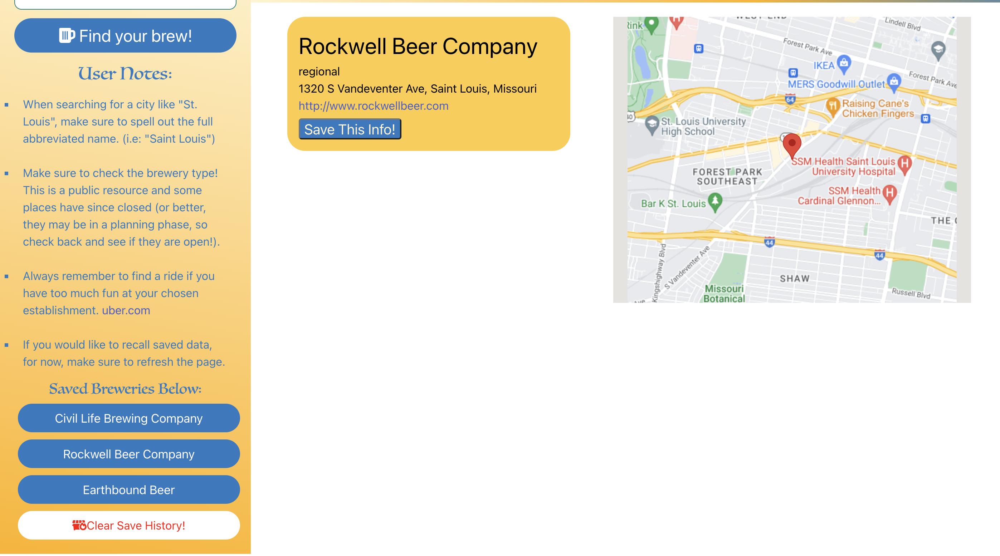

# Brewery Finder
## Group Project 1

[Find Your Brew](https://vincenttoon.github.io/brewery-finder/)

## Deployment team

[Vincent Toon](https://github.com/Vincenttoon)  
[Rafiqullah Nasrat](https://github.com/rafiqnasrat)  
[Jospeh Weidhass](https://github.com/weidhaas)

## Instructions for Challenge

- Use a CSS framework other than Bootstrap.
- Be deployed to GitHub Pages.
- Be interactive (i.e., accept and respond to user input).
- Use at least two server-side APIs.
- Does not use alerts, confirms, or prompts (use modals).
- Use client-side storage to store persistent data.
- Be responsive.
- Have a polished UI.
- Have a clean repository that meets quality coding standards (file structure, naming conventions, follows best practices for class/id naming conventions, indentation, quality comments, etc.).
- Have a quality README (with unique name, description, technologies used, screenshot, and link to deployed application).

## Third Part API's Used

[Open Brewery DB](https://www.openbrewerydb.org/)  
[Google Maps Platform](https://developers.google.com/maps)

### Things Learned

- async and await: async functions run on page load/when function is called. await is a parameter given to a JS action so it is called whenever data is loaded/time is passed the JS carries out it's function.
- use of reverse quotes (`): allows for Jquery inserts onto API links.
- (/\s/g helps replace spaces: regular expression editing!
- how to implement, place and work the google maps API: This was very hard and required a lot of steps but felt good to get the map working

### Page Bugs
- Needs more error handling on city search.
- Allow for more thorough search instead of a 20 brewery limit based on alphabetical order (if possible)
- Do Not Generate Closed or Planned breweries.
- Allow saved buttons to load page on click before page refresh.

### Plans for Future Changes

- Make Search for Near button, that prompts (modal) you to search for nearby breweries based on your current location

### USER STORY
- AS a person who wants to have a tasty beverage
- I WANT to see what breweries are in the city I'm going to
and what is available nearby

### USER STORY DETAILS
- If I put in a city to look at
- THEN an available list of breweries are displayed
- *!IF I want to find something near me!
- *!THEN I can search by distance and what is around me!
- IF I want to look back on what has interested me
- THEN local storage can access my liked data
- WHEN I click on a listed brewery
- THEN a Google Map with Information Displays

#### Original Draft Framework of Homescreen
<<<<<<< HEAD
